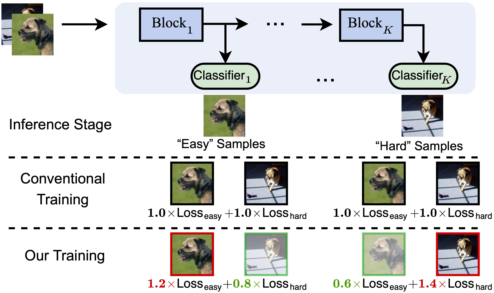
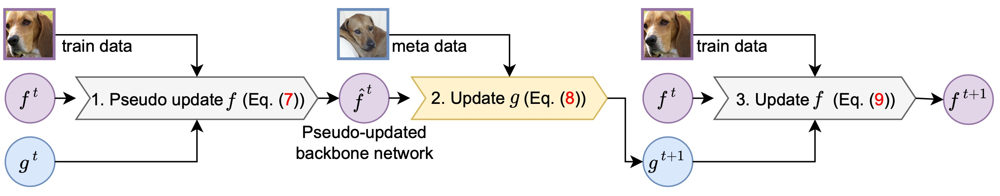
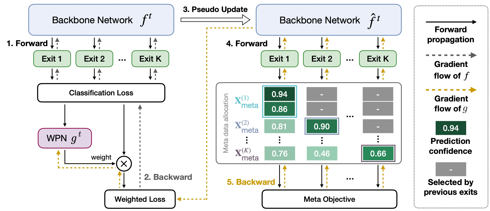
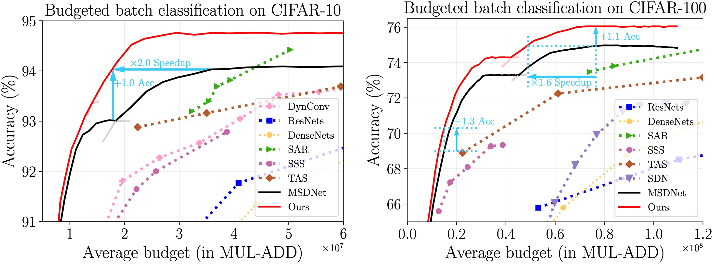
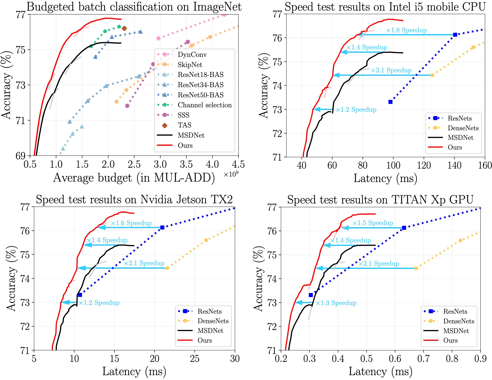

# Learning to Weight Samples for Dynamic Early-exiting Networks (ECCV 2022)

[Yizeng Han][]* , [Yifan Pu][]*, [Zihang Lai][], [Chaofei Wang][], [Shiji Song][], Junfeng Cao, Wenhui Huang, Chao Deng, [Gao Huang][].

*: Equal contribution.


## Introduction

This repository contains the implementation of the paper, Learning to Weight Samples for Dynamic Early-exiting Networks (ECCV 2022). The proposed method adopts a weight prediction network to weight the training loss of different samples for dynamic early exiting networks, such as [MSDNet][] and [RANet][], and improves their performance in the dynamic early exiting scenario. 

### Overall idea




### Training pipeline




### Gradient flow of the meta-learning algorithm



## Usage

### Dependencies

- Python: 3.8
- Pytorch: 1.10.0
- Torchvision: 0.11.0

### Scripts

- Train a MSDNet (5 exits, step=4) on ImageNet:

```bash
CUDA_VISIBLE_DEVICES=0,1,2,3,4,5,6,7 python tools/main_imagenet_DDP.py \
--train_url YOUR_SAVE_PATH \
--data_url YOUR_DATA_PATH --data ImageNet --workers 64 --seed 0 \
--arch msdnet --nBlocks 5 --stepmode even --step 4 --base 4 --nChannels 32 --growthRate 16 --grFactor 1-2-4-4 --bnFactor 1-2-4-4 \
--meta_net_hidden_size 500 --meta_net_num_layers 1 --meta_interval 100 --meta_lr 1e-4 --meta_weight_decay 1e-4 \
--epsilon 0.3 --target_p_index 15 --meta_net_input_type loss --constraint_dimension mat \
--epochs 100 --batch-size 4096 --lr 0.8 --lr-type cosine --print-freq 10
```

- Train a MSDNet (5 exits, step=4) on ImageNet (on [high-flyer yinghuo](https://www.high-flyer.cn/en/) cluster):
```bash
hfai python tools/main_imagenet_DDP_HF.py \
--train_url YOUR_SAVE_PATH \
--data_url YOUR_DATA_PATH --data ImageNet --workers 64 --seed 0 \
--arch msdnet --nBlocks 5 --stepmode even --step 4 --base 4 --nChannels 32 --growthRate 16 --grFactor 1-2-4-4 --bnFactor 1-2-4-4 \
--meta_net_hidden_size 500 --meta_net_num_layers 1 --meta_interval 100 --meta_lr 1e-4 --meta_weight_decay 1e-4 \
--epsilon 0.3 --target_p_index 15 --meta_net_input_type loss --constraint_dimension mat \
--epochs 100 --batch-size 4096 --lr 0.8 --lr-type cosine --print-freq 10 \
-- --nodes=1 --name=YOUR_EXPERIMENT_NAME
```

- Evaluate (anytime):

```bash
CUDA_VISIBLE_DEVICES=0 python tools/eval_imagenet.py \
--data ImageNet --batch-size 512 --workers 8 --seed 0 --print-freq 10 --evalmode anytime \
--arch msdnet --nBlocks 5 --stepmode even --step 4 --base 4 --nChannels 32 --growthRate 16 --grFactor 1-2-4-4 --bnFactor 1-2-4-4 \
--data_url YOUR_DATA_PATH \
--train_url YOUR_SAVE_PATH \
--evaluate_from YOUR_CKPT_PATH
```

- Evaluate (dynamic):

```bash
CUDA_VISIBLE_DEVICES=0 python tools/eval_imagenet.py \
--data ImageNet --batch-size 512 --workers 2 --seed 0 --print-freq 10 --evalmode dynamic \
--arch msdnet --nBlocks 5 --stepmode even --step 4 --base 4 --nChannels 32 --growthRate 16 --grFactor 1-2-4-4 --bnFactor 1-2-4-4 \
--data_url YOUR_DATA_PATH 
--train_url YOUR_SAVE_PATH  \
--evaluate_from YOUR_CKPT_PATH
```


### Results

- CIFAR-10 and CIFAR-100



- ImageNet



### Pre-trained Models on ImageNet
|model config|epoches|labelsmooth|acc_exit1|acc_exit2|acc_exit3|acc_exit4|acc_exit5|Checkpoint Link|
|:-:|:-:|:-:|:-:|:-:|:-:|:-:|:-:|:-:|
|   step=4   |  100  |    N/A    |  59.54  |  67.22  |  71.03  |  72.33  |  73.93  |[Tsinghua Cloud](https://cloud.tsinghua.edu.cn/f/469af5c3b186439b84cd/?dl=1) / [Google Drive](https://drive.google.com/file/d/1etEWSBcvuHBXJXCgbcQsm0P1raXkbKFh/view?usp=sharing)|
|   step=6   |  100  |    N/A    |  60.05  |  69.13  |  73.33  |  75.19  |  76.30  |[Tsinghua Cloud](https://cloud.tsinghua.edu.cn/f/66e2ed9a4d9241a79602/?dl=1) / [Google Drive](https://drive.google.com/file/d/1jTib6QTRt1LUHC2IOcjtxGuzEE2rAnab/view?usp=sharing)|
|   step=7   |  100  |    N/A    |  59.24  |  69.65  |  73.94  |  75.66  |  76.72  |[Tsinghua Cloud](https://cloud.tsinghua.edu.cn/f/0f018f3024c74f2494d2/?dl=1) / [Google Drive](https://drive.google.com/file/d/1UULtwMzffDOief9WSbk46jOiFBXal5yP/view?usp=sharing)|
|   step=4   |  300  |    0.1    |  61.64  |  67.89  |  71.61  |  73.82  |  75.03  |[Tsinghua Cloud](https://cloud.tsinghua.edu.cn/f/496543cfbbc741e380dd/?dl=1) / [Google Drive](https://drive.google.com/file/d/1SNFnCPdFrw-4QhA8gLX2g2vjicZ1dNnN/view?usp=sharing)|
|   step=6   |  300  |    0.1    |  61.41  |  70.70  |  74.38  |  75.80  |  76.66  |[Tsinghua Cloud](https://cloud.tsinghua.edu.cn/f/af63fdd6418d4cee8eba/?dl=1) / [Google Drive](https://drive.google.com/file/d/1h1sVZOyNpEVI8CDVsH-xZid0BHsWTUV6/view?usp=sharing)|
|   step=7   |  300  |    0.1    |  60.94  |  71.88  |  75.13  |  76.03  |  76.82  |[Tsinghua Cloud](https://cloud.tsinghua.edu.cn/f/b1b706e7b7984051b10a/?dl=1) / [Google Drive](https://drive.google.com/file/d/1nPPdGSHn15zVm0FXSzcFFHpvdW9YpcFJ/view?usp=sharing)|

### Contact

If you have any questions, please feel free to contact the authors. 

Yizeng Han: [hanyz18@mails.tsinghua.edu.cn](mailto:hanyz18@mails.tsinghua.edu.cn), [yizeng38@gmail.com](mailto:yizeng38@gmail.com)

Yifan Pu: [pyf20@mails.tsinghua.edu.cn](mailto:pyf20@mails.tsinghua.edu.cn), [yifanpu98@126.com](mailto:yifanpu98@126.com)


## Ackowledgements

We use the pytorch implementation of [MSDNet-PyTorch][], [RANet-PyTorch][] and [IMTA][]  in our experiments.


[Yizeng Han]: https://yizenghan.top/
[Yifan Pu]: https://yifanpu001.github.io/
[Zihang Lai]: https://scholar.google.com/citations?user=31eXgMYAAAAJ&hl=en
[Chaofei Wang]: https://scholar.google.com/citations?user=-hwGMHcAAAAJ&hl=zh-CN&oi=ao
[Shiji Song]:https://scholar.google.com/citations?user=rw6vWdcAAAAJ&hl=en
[Gao Huang]:http://www.gaohuang.net/
[MSDNet]:https://arxiv.org/abs/1703.09844
[RANet]:https://arxiv.org/abs/2003.07326
[MSDNet-PyTorch]:https://github.com/kalviny/MSDNet-PyTorch
[RANet-PyTorch]:https://github.com/yangle15/RANet-pytorch
[IMTA]:https://github.com/kalviny/IMTA